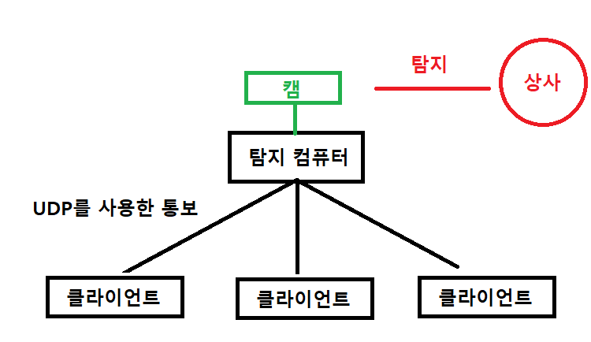

# BossDetector - 사각지대의 직장 상사를 탐지하기 위한 프로젝트
=============
목적
=============
* 일부 디텍션 모델이나 모듈을 사용하는 방법을 알려주기 위함

작동 방식
=============

1. 설치된 캠으로 프레임을 가져옴
2. 가져온 프레임이 사람이 있는지 탐지
3. 사람이 탐지되었다면 직장 상사인지 아닌지 분류
4. 등록된 클라이언트에 발견 사항을 전파함
5. 전파 받은 클라이언트는 데스크탑 화면을 빨간 색상으로 잠시 변경합니다

문제점
=============
* 상사 데이터셋을 모으는 중이므로 사람을 탐지하면 발견사항을 전파합니다

경고
=============
실제 사용하다 걸려서 짤리는 것에 대해서 책임을 지지않음